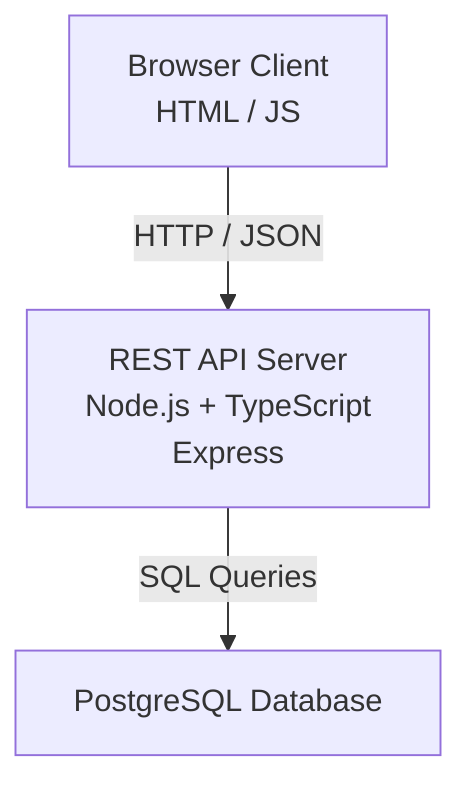
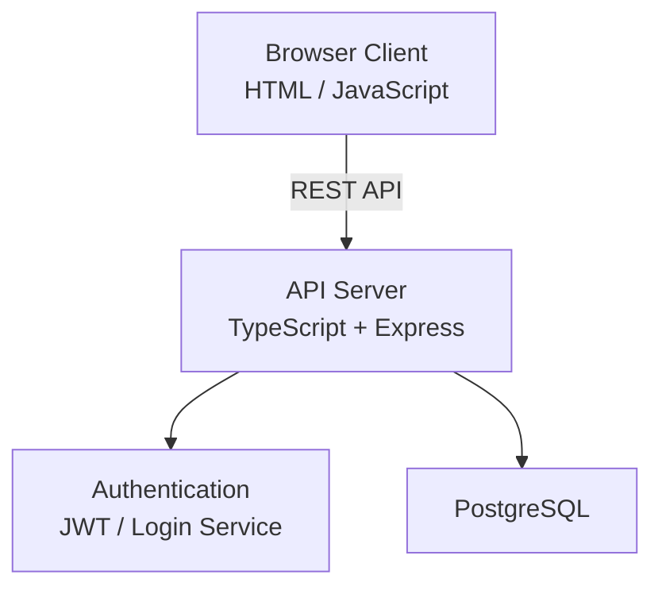
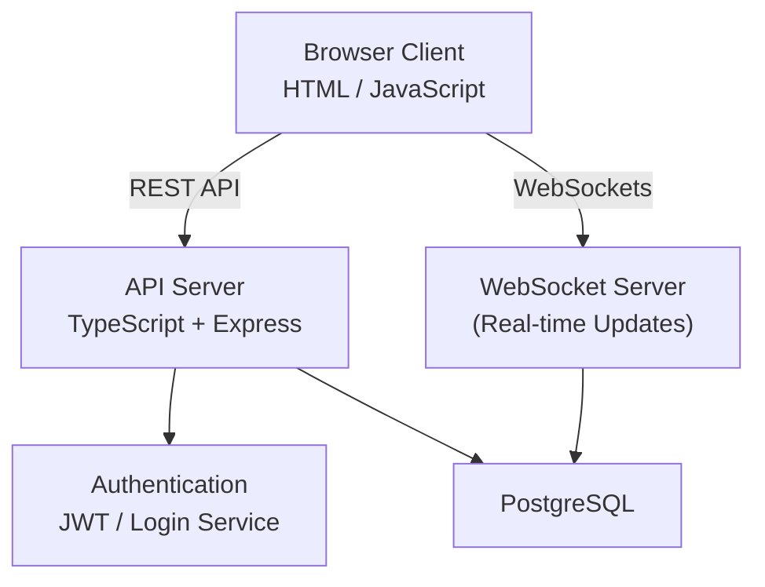

Week 2 Diagram

```mermaid
flowchart TD

Client["Browser Client
HTML / JS"]

API["REST API Server
Node.js + TypeScript
Express"]

DB["PostgreSQL Database"]

Client -->|HTTP / JSON| API
API -->|SQL Queries| DB
```

Week 5 Diagram

```mermaid
flowchart TD

Client["Browser Client
HTML / JavaScript"]

API["API Server
TypeScript + Express"]

Auth["Authentication
JWT / Login Service"]

DB["PostgreSQL"]

Client -->|REST API| API

API --> Auth
API --> DB
```

Week 7 Diagram

```mermaid
flowchart TD

Client["Browser Client
HTML / JavaScript"]

API["API Server
TypeScript + Express"]

Auth["Authentication
JWT / Login Service"]

DB["PostgreSQL"]

Realtime["WebSocket Server
(Real-time Updates)"]

Client -->|REST API| API
Client -->|WebSockets| Realtime

API --> Auth
API --> DB
Realtime --> DB
```